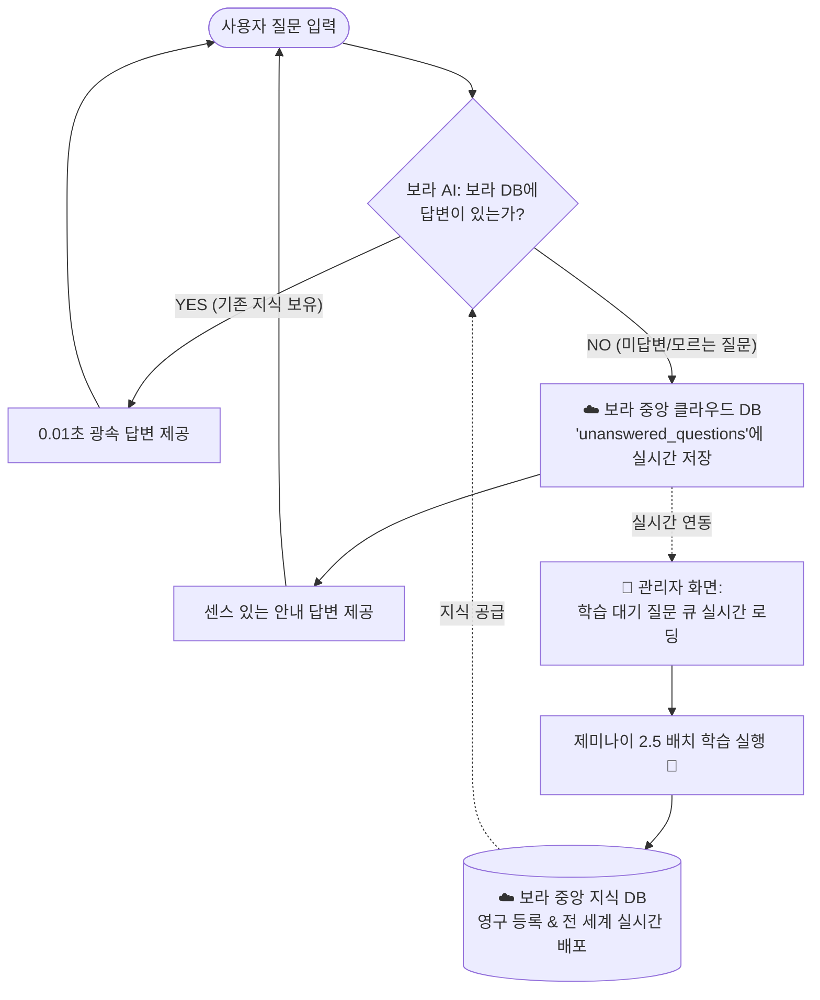

# 📜 TravelKorea VORA Project Master History & Daily Continuity Log
> **본 문서는 헌법 제1조에 따라 AI가 매일 아침/세션 시작 시 0.1초 만에 최우선으로 읽고, 사용자에게 선(先) 브리핑하기 위한 영구 마스터 기록 장부입니다.**

---

## 🌟 [★ Golden Architecture: 보라 AI 자가 학습 플라이휠 설계도]
- **설계자**: 사용자(선배님) 직접 제안 및 확정
- **등록일**: 2026-08-28

---

## 📅 Daily Continuity History

### [2026-08-28 (금) - 현재 세션]
1. **완료된 작업**:
   - **헌법 제1조 제정**: `100% 전자동 기록 & 세션 시작 시 자동 선(先) 브리핑 헌법` 최상단 배치.
   - **전국 100대 섬/명소 키워드 맵핑 (`geminiNlpService.js`)**: 통영(욕지도·사량도), 완도(청산도·보길도), 신안(퍼플섬·홍도·흑산도), 여수(금오도 비렁길), 제주(우도) 등 전수 등록.
   - **초고속 Q&A 지식 매칭 완화 (`voraQnaMatcher.js`)**: 도시 미선택 상태에서도 질문 일치도 75점 이상 시 0.01초 만에 지식 즉시 매칭 프리패스 장착.
   - **관리자 2열 와이드 대시보드 리뉴얼 & 중복 제거/삭제 기능 (`AdminBatchModal.jsx`)**: 1040px 와이드 뷰, 중복 Upsert 및 `[ 🗑️ ]` 개별 삭제 완료.
   - **통영 & 욕지도 정품 로컬 지식 팩 탑재 (`voraDialogKnowledge.js`)**: 출렁다리, 펠리컨바위, 고등어회, 고메원도넛, 삼덕항 배편 정보 탑재.
2. **진행 중 / 다음 작업 1순위**:
   - **[자가 학습 플라이휠 파이프라인] 실시간 클라우드 직결**:
     - ① 사용자의 미답변 질문 발생 시 `voraCloudQnaService`를 통해 중앙 클라우드 DB에 실시간 전송 & 축적.
     - ② 관리자 화면 [학습 대기 질문 큐]가 로컬이 아닌 중앙 클라우드 DB에서 실시간 로딩되도록 연동.
     - ③ 통영 추천 카드에서 경남 타 지역(하동 등)이 섞이지 않도록 `sigunguCode: 17` 및 주소 필터 완벽 고정.

---

### [2026-08-27 (목) - 전날 세션]
1. **완료된 작업**:
   - 관리자 배치 모달에 ✍️ 수동 질문 추가 바 장착.
   - `독도`, `독도새우` 제미나이 2.5 배치 학습 정상 작동 검증.
   - 전국 20대 핵심 권역(울릉/독도, 단양, 순천, 남해, 포항, 안동, 태안, 진도, 군산 등) 로컬 가이드 팩 탑재.
